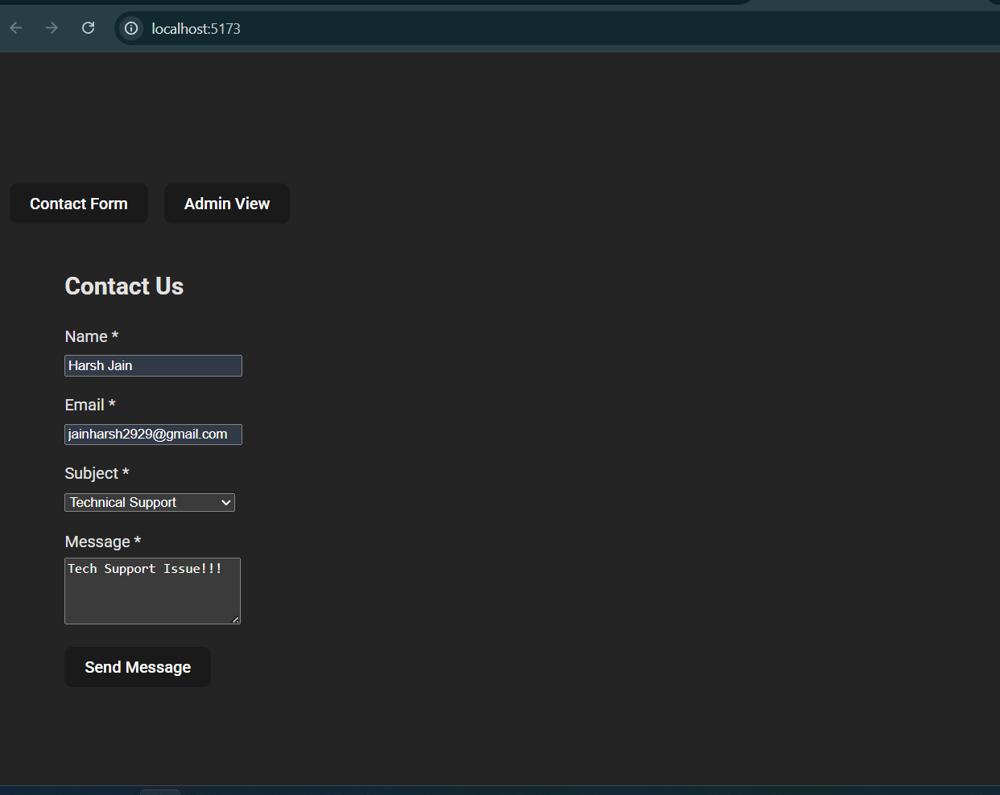
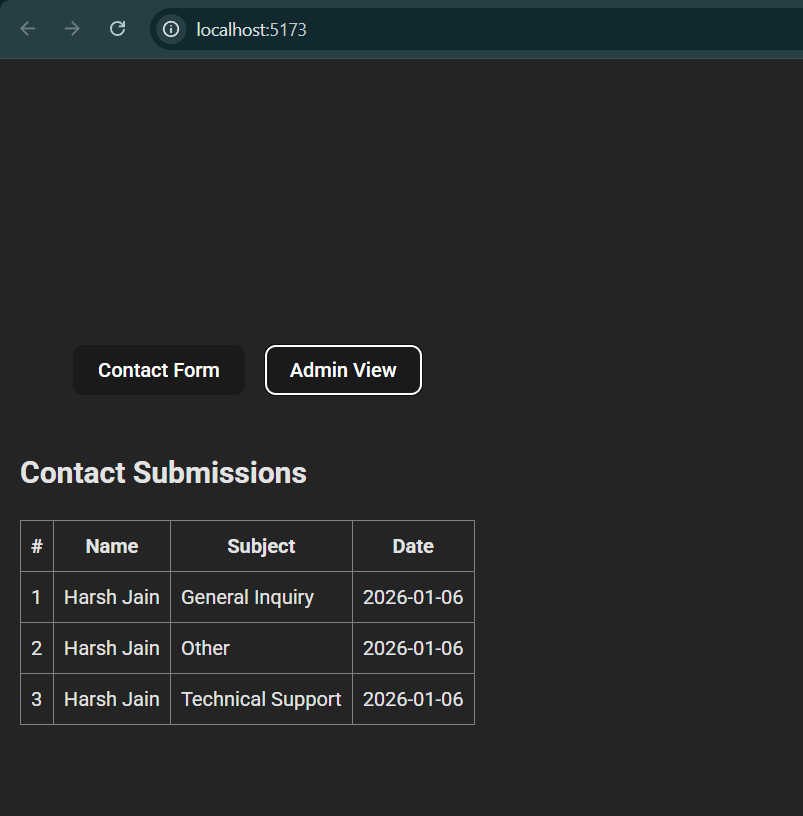

# Contact Form

A simple full-stack contact form with a React (Vite) frontend and a Node.js/Express backend.
The form validates input on the client and server and stores submissions in a JSON file, with an admin view to list all submissions.

## Tech Stack

- React (Vite)
- Node.js + Express
- JSON file persistence

## Project Structure

```txt
contact-form/
├── client/              # React frontend
│   ├── src/
│   │   ├── components/
│   │   │   ├── ContactForm.jsx
│   │   │   ├── FormField.jsx
│   │   │   ├── SuccessMessage.jsx
│   │   │   └── SubmissionsList.jsx
│   │   ├── App.jsx
│   │   └── main.jsx
│   └── package.json
├── server/              # Express backend
│   ├── index.js
│   ├── data.json
│   └── package.json
└── README.md
```

## Features

- **Contact form fields**: name, email, subject, message.
- **Client-side validation**:
  - Name: required, minimum 2 characters.
  - Email: required, valid email format.
  - Subject: required (predefined options).
  - Message: required, minimum 10 characters.
- **Server-side validation** with the same rules.
- **Persistence**: Stores submissions in `server/data.json` with `id` and `createdAt`.
- **Admin view** to list all submissions.

## Getting Started

### 1. Backend

```bash
cd server
npm install
node index.js
```

Server runs on http://localhost:3001.

**API endpoints:**

- `POST /api/contact` – create a new submission.
- `GET /api/contact` – list all submissions.

### 2. Frontend

```bash
cd client
npm install
npm run dev
```

Vite dev server (by default) on http://localhost:5173.
The frontend is configured to call the backend at http://localhost:3001.

## Usage

1. Open the frontend in your browser.
2. Fill in all fields and submit.
3. On success, a thank you message is shown.
4. Switch to the Admin View to see all stored submissions.

## Screenshots

### Contact Form


### Admin View


## Possible Improvements

- Better styling and responsive layout.
- Delete submissions from admin view.
- Stronger validation and schema-based validation.
- Deploy backend and frontend to a cloud provider.